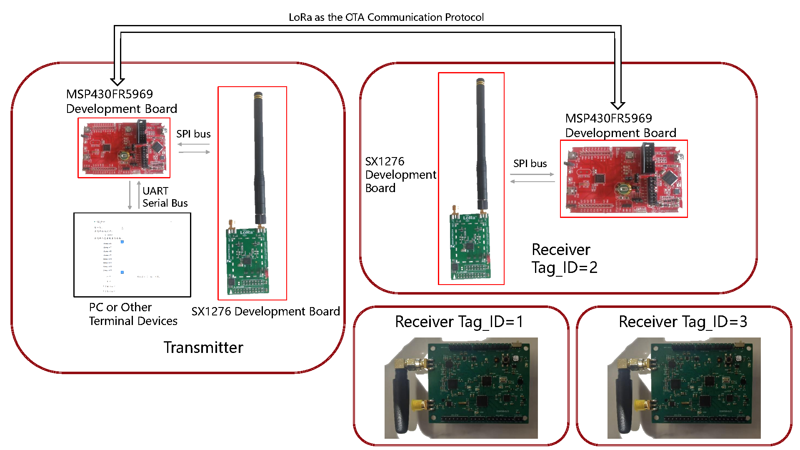
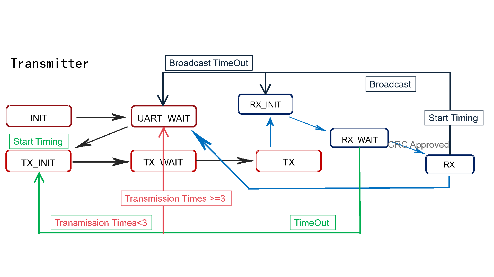
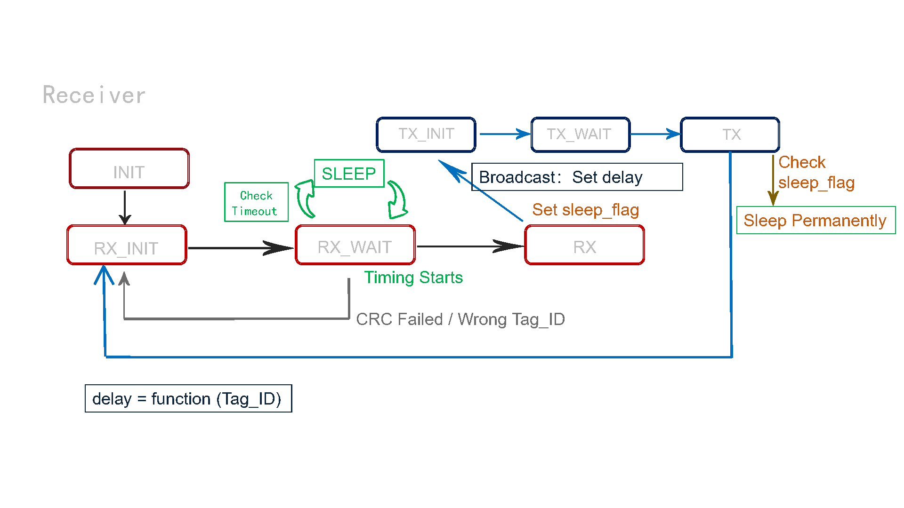

# ⛳ Design of LoRa MAC Layer in Ultra-Low Power SDR

## 🎈 Background

LoRa
- an ideal OTA (over-the-air) communication protocol for SD-PHY (software defined physical layer)
- long range, low power consumption, and anti-interference
- fixed PHY layer
- open MAC layer

## ✒️ Architecture

We utilize an MCU to control LoRa as its OTA protocol. Specifically, on the transmitter end, we primarily employ an MSP430 development board to control a LoRa (SX1276) development board. They communicate via the SPI bus. Additionally, we have a frontend interface on the computer, developed using the QT framework. It controls the MSP430 development board via UART serial communication. On the receiver end, it also employs an MSP430 development board for control of the LoRa development board, communicating via the SPI bus.

## :beverage_box: Implementation

- Designing LoRa MAC Layer:
  - Designing frame format for LoRa MAC layer.
  - Implementing timeout retransmission mechanism.
  - Adding broadcast capability.
- Adding duty_cycle for sleep implementation.
- Designing frontend interface:
  - Adding control for respective functionalities.
  - Porting to Linux system.
  - Beautifying interface.
- Deploying in conjunction with circuit schematics to software-defined radio hardware platform.

## :bookmark_tabs: State Machines

## 📖 Instructions

- Transmitter
  - QT interface: User-interface-transmitter
  - MCU codes: firmware/LoRa_transmit
- Receiver
  - QT interface: User-interface-receiver
  - MCU codes: firmware/SD_PHY

